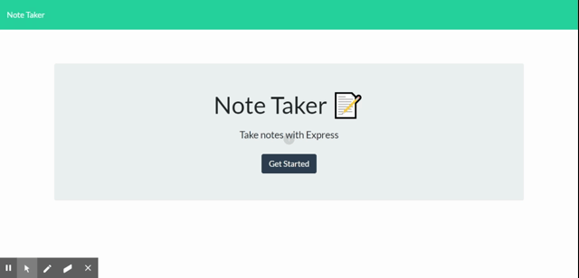

# Note-Taker

## Working Demo

## Description

The application that can be used to write, save, and delete notes so that one can organize their thoughts and keep track of tasks that they need to complete.

## Usage

This application uses an express backend and save and retrieve note data from a JSON file.

* HTML routes:

  * GET `/` - returns the `index.html` file
  * GET `/notes` - returns the `notes.html` file.
  * GET `*` - returns the `index.html` file

* The application has a `db.json` file on the backend that will be used to store and retrieve notes using the `fs` module.

* API routes:

  * GET `/api/notes` - reads the `db.json` file and return all saved notes as JSON.

  * POST `/api/notes` - receives a new note to save on the request body.

  * DELETE `/api/notes/:id` - receives a query parameter containing the id of a note to delete.

## Sources Referred 

* Serving static files in Express:http://expressjs.com/en/starter/static-files.html

* How to remove an element from an Array in JavaScript: https://flaviocopes.com/how-to-remove-item-from-array/

## URL of Deployed Application

https://desolate-island-95252.herokuapp.com/
